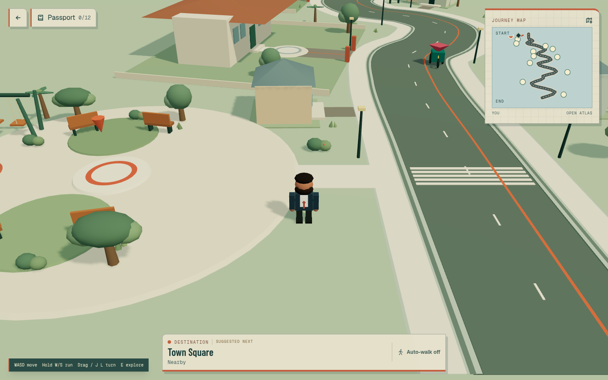
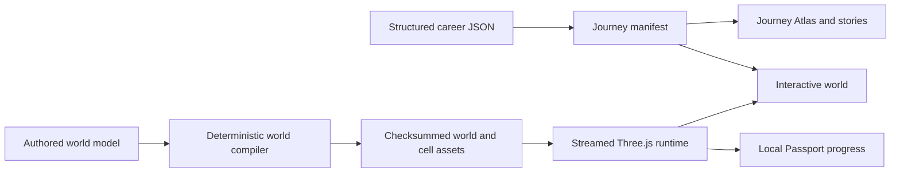

# Foliofarer

**An explorable 3D developer portfolio with a complete, accessible career Atlas.**

[](https://www.supportkori.com/montasim)
[](https://foliofarer.netlify.app)

Foliofarer turns Mohammad Montasim Al Mamun Shuvo's structured career records into a code-generated world. Visitors can walk through 12 professional landmarks, follow an assisted route, collect device-local Passport stamps, or read the same evidence directly in the Journey Atlas without using WebGL.

**[Open Foliofarer](https://foliofarer.netlify.app)** · [Run it locally](#run-locally) · [Report an issue](https://github.com/montasim/foliofarer/issues) · [View Montasim's portfolio](https://montasim.vercel.app)



> [!NOTE]
> Foliofarer is publicly deployed at [foliofarer.netlify.app](https://foliofarer.netlify.app). The screenshot above is maintained as a Playwright visual baseline.

## Why Foliofarer?

Traditional portfolios are efficient to scan but rarely show how education, work, projects, learning, and community contributions connect. Fully interactive portfolios can be memorable, but they often make important evidence harder to reach.

Foliofarer keeps both paths available:

- Explore a stylized world that presents the career chronology spatially.
- Open the Atlas to read every portfolio record directly.
- Continue through the Atlas when WebGL is unavailable or interrupted.
- Track optional physical visits without locking or hiding any content.

The 3D world adds discovery; it is never required to access the professional record.

## What visitors can do

- Travel through 12 landmarks covering education, career, learning, projects, community work, and contact.
- Select a destination from the minimap or Atlas and follow an optional assisted route.
- Open a nearby landmark to read its story, evidence, links, and related records.
- Review the complete chronology from the Journey Atlas without walking through the world.
- Collect Passport stamps for physically visited landmarks and retain progress on the current device.
- Use keyboard controls on desktop or a touch joystick on coarse-pointer and smaller devices.
- Continue in the Atlas when WebGL initialization fails or the rendering context is lost.
- Respect reduced-motion, reduced-data, connection, viewport, and device-capability signals through adaptive rendering tiers.

## Using Foliofarer

Foliofarer attempts to open the 3D world automatically. The Atlas remains available from the map control and becomes the primary view when the renderer is unavailable.

### Explore the world

| Control | Action |
| --- | --- |
| `W`, `A`, `S`, `D` or arrow keys | Move |
| `Shift` | Run while moving |
| `E` | Open the story for a nearby landmark |
| `M` | Open the Atlas |
| `P` | Open the Passport |
| Touch joystick | Move on touch-oriented devices |

Choose a destination from the Atlas or minimap. The route control can guide the avatar automatically; reduced-motion preferences disable assisted travel while leaving manual movement and the Atlas available.

### Read the Atlas

Open the Atlas to browse the complete chronology, select a destination, and read any story directly. Atlas reading does not award Passport stamps because stamps represent physical visits inside the world.

### Track Passport progress

Reaching a landmark checkpoint stamps the Passport. Progress and optional journey completion are stored in browser `localStorage` under `montasim-journey-passport-v1`. Clearing site data resets that progress; when storage is blocked, progress lasts only for the current session.

## How it works



The application separates professional content from 3D traversal. Career data and the Journey manifest feed the DOM-based Atlas and story interfaces. The world compiler turns authored geometry and placement rules into checksummed JSON assets, which the browser runtime loads by cell. Navigation, collisions, checkpoints, adaptive rendering, and context recovery remain runtime concerns.

## Technology

| Area | Technology |
| --- | --- |
| Application | Next.js 16, React 19, TypeScript 5 |
| 3D rendering | Three.js, React Three Fiber, Drei |
| Legacy physics path | React Three Rapier |
| Styling | Tailwind CSS 4 |
| World generation | Deterministic TypeScript generators, polygon clipping, Earcut, simplex noise |
| Quality | ESLint, Node test runner, Playwright visual and browser tests |

## Run locally

### Requirements

- Node.js 20.9 or newer, as required by the installed Next.js release
- pnpm; the repository is currently verified with pnpm 11
- A WebGL-capable browser for the 3D world
- Google Chrome for the configured Playwright browser suites

The application has no database, authentication service, or required secret credentials.

### 1. Clone and install

```bash
git clone https://github.com/montasim/foliofarer.git
cd foliofarer
pnpm install
```

### 2. Configure optional public URLs

Foliofarer runs locally without an environment file. Add `.env.local` only when the default destinations do not fit the deployment:

| Variable | Default | Purpose |
| --- | --- | --- |
| `NEXT_PUBLIC_APP_URL` | `https://foliofarer.netlify.app` | Canonical origin used by Next.js metadata |
| `NEXT_PUBLIC_PORTFOLIO_URL` | `https://montasim.vercel.app` | Destination of “return to portfolio” controls |

Both values are exposed to the browser. Do not put secrets in either variable or in any `NEXT_PUBLIC_*` setting.

### 3. Start the development server

```bash
pnpm dev
```

Open [http://localhost:3000](http://localhost:3000). The same experience is also available at `/journey` for compatibility with the existing browser tests.

## Commands

| Command | Purpose |
| --- | --- |
| `pnpm dev` | Start the Next.js development server with Turbopack |
| `pnpm build` | Regenerate the v3 world and create a production build |
| `pnpm start` | Serve the production build |
| `pnpm typecheck` | Check TypeScript without emitting files |
| `pnpm lint` | Run ESLint |
| `pnpm format` | Format TypeScript and TSX files with Prettier |
| `pnpm test:unit` | Run generator and runtime unit tests with Node |
| `pnpm test:journey` | Build and run the current Playwright journey suite |
| `pnpm test:journey:legacy` | Build and run the legacy visual and interaction suite |
| `pnpm test:journey:update` | Rebuild and update current Playwright snapshots |
| `pnpm generate:journey-v3` | Generate the current streamed world assets |
| `pnpm validate:journey-v3` | Validate current compiler output and determinism |
| `pnpm generate:journey-v2` | Regenerate legacy world assets |
| `pnpm validate:journey-v2` | Validate legacy generated assets |

`pnpm build` runs `generate:journey-v3` through the `prebuild` hook. Review generated changes before committing modifications to the authored world or generator.

## Project structure

```text
app/                         Next.js entry points, metadata, error UI, and styles
components/journey-v2/       Current Atlas, Passport, map, controls, and canvas UI
components/journey/          Shared controls plus the earlier world implementation
data/                        Structured professional records
lib/journey/                 Content manifest, stories, navigation, and shared types
lib/journey-v2/authored/     Code-authored world definitions
lib/journey-v2/generator/    Deterministic world compiler and validation
lib/journey-v2/runtime/      Streaming, rendering, navigation, and collision runtime
public/journey-v2/           Generated world manifests and cell assets
scripts/journey-v2/          Generation and validation entry points
tests/journey-v2/            Current compiler, runtime, accessibility, and browser tests
tests/journey/               Legacy interaction, performance, and visual contracts
docs/adr/                    Architecture decision records
```

## Updating content and world assets

Professional records live in `data/*.json`; the Journey manifest connects those records to chronological stories and landmarks. Keep claims factual and verify external links when changing career content.

World changes begin in `lib/journey-v2/authored/` or the generator modules. After an update, run:

```bash
pnpm generate:journey-v3
pnpm validate:journey-v3
pnpm typecheck
pnpm lint
pnpm test:unit
pnpm build
```

Run `pnpm test:journey` when Chrome is available. Update screenshots only after visually reviewing an intentional interface change.

## Deployment

The maintained deployment runs at [foliofarer.netlify.app](https://foliofarer.netlify.app). Foliofarer can also be deployed to another Next.js-compatible host without backend services:

1. Set `NEXT_PUBLIC_APP_URL` to the production origin.
2. Set `NEXT_PUBLIC_PORTFOLIO_URL` when the standard portfolio uses another destination.
3. Install dependencies with the committed lockfile.
4. Run `pnpm build`; the prebuild hook regenerates the world assets.
5. Serve with `pnpm start` or the hosting provider's Next.js runtime.

Generated world assets are part of the application output and must remain available under `/journey-v2/`.

## Status, privacy, and limitations

- The world requires WebGL and is more resource-intensive than the Atlas. Rendering quality adapts to motion and data preferences, connection hints, device memory, hardware concurrency, pointer type, and viewport width.
- The Atlas preserves access to professional evidence when WebGL is unavailable, initialization fails, or the rendering context is lost.
- Passport state is device-local browser data. The app has no account sync, cloud save, or server-side progress store.
- Runtime world assets are fetched from the same application origin. The standalone app does not require a third-party API.
- Analytics calls are no-ops unless a host supplies a compatible global `gtag` function. This repository does not load an analytics provider itself.
- Career records are maintained portfolio content, not independently verified credentials. Follow the linked source material or contact the author when verification matters.
- Automated tests cover generation, validation, navigation, accessibility, interactions, visual baselines, and selected performance contracts; they do not guarantee identical graphics performance across every browser and GPU.
- Known test debt: `pnpm test:unit` currently passes 65 of 68 tests. Three v3 compiler assertions fail around a generated geometry buffer, chronology spacing, and the minimum grass-tuft count; type checking, linting, v3 validation, and the production build pass.
- The public Netlify deployment is the maintained production instance; graphics performance still varies across browsers and GPUs.

## Documentation

- [Journey domain and interaction vocabulary](CONTEXT.md)
- [Architecture decision records](docs/adr/)
- [Current desktop visual baseline](tests/journey/__screenshots__/journey-desktop.png)
- [Current world definition](lib/journey-v2/authored/world-v3.ts)
- [Generated world validation](scripts/journey-v2/validate-v3.ts)

## Contributing, support, and security

Focused bug fixes, accessibility improvements, performance work, documentation corrections, and verified portfolio-data corrections are welcome. Use [GitHub Issues](https://github.com/montasim/foliofarer/issues) for reproducible public reports and [Pull Requests](https://github.com/montasim/foliofarer/pulls) for reviewable changes.

Include the browser, operating system, input method, affected route or landmark, and reproduction steps in bug reports. Do not publish private personal information, credentials, or vulnerability details in an issue; use the contact options on [Montasim's GitHub profile](https://github.com/montasim) for sensitive reports.

This repository does not currently include dedicated `CONTRIBUTING.md`, `SECURITY.md`, `CODE_OF_CONDUCT.md`, or `SUPPORT.md` files. Until those policies are added, the issue tracker and maintainer profile are the documented support paths.

## Funding

Optional SupportKori contributions help fund hosting, testing, accessibility work, and continued development. Bug reports, code contributions, documentation improvements, and sharing the project are equally valuable.

[](https://www.supportkori.com/montasim)

GitHub's funding link is configured in [`.github/FUNDING.yml`](.github/FUNDING.yml).

## Author

Built and maintained by [Mohammad Montasim Al Mamun Shuvo](https://github.com/montasim).

## License

This repository does not currently include a license file. Copyright remains with the author, and no open-source license should be assumed. Portfolio text, personal data, screenshots, and third-party marks may have separate usage rights.
